# 🔬 Awesome-Research-Management

<p align="center">
  <a href="assets/banner.svg"></a>
</p>

<p align="center">
  <a href="https://github.com/ishandutta2007/Awesome-Awesome-Awesome"></a><a href="https://discord.gg/jc4xtF58Ve"></a>
  <a href="https://github.com/ishandutta2007/Awesome-Research-Management/stargazers"></a>
  <a href="https://github.com/ishandutta2007/Awesome-Research-Management/network/members"></a>
  <a href="https://github.com/ishandutta2007/Awesome-Research-Management/pulls"></a>
  <a href="https://github.com/ishandutta2007/Awesome-Research-Management/blob/main/LICENSE"></a>
  <a href="https://github.com/ishandutta2007"></a>
</p>

---

## 🏛️ Top Research Management Platforms & Scholarly Ecosystem

**A Curated List of Enterprise SaaS Products & Open-Source GitHub Projects for Research Information Management (CRIS/RIM), Institutional Repositories (IR), Research Data Management (RDM), and Academic Analytics.**

*Focusing on Current Research Information Systems (CRIS), Researcher Profiles, Faculty Activity Reporting, Scholarly Publications, Research Output Tracking, Grant Administration, and Open Science Infrastructure.*

📅 **Last updated:** September 2026

---

## 📑 Table of Contents

- [🌐 Overview & Ecosystem Architecture](#-overview--ecosystem-architecture)
- [💼 Commercial SaaS & Hosted Platforms](#-commercial-saas--hosted-platforms)
- [🔓 Open-Source GitHub Projects](#-open-source-github-projects)
- [🏗️ Architectural Frameworks for Custom Deployments](#️-architectural-frameworks-for-custom-deployments)
- [📈 Star History](#-star-history)
- [🤝 How to Contribute](#-how-to-contribute)
- [⚖️ Disclaimer](#️-disclaimer)

---

## 🌐 Overview & Ecosystem Architecture

Research Management Systems—frequently designated as **Current Research Information Systems (CRIS)** or **Research Information Management (RIM)** systems—serve as the mission-critical digital backbone for modern research institutions, universities, medical academies, and government labs. 

These platforms aggregate, enrich, showcase, and evaluate scholarly assets across institutional boundaries:
- 👤 **Researcher Profiles & Networks**: Centralizing identity, ORCID synchronization, academic credentials, and subject expertise.
- 📚 **Publications & Scholarly Outputs**: Automating multi-source harvesting (Crossref, PubMed, Scopus, Web of Science, arXiv), open-access compliance verification, and institutional repository deposits.
- 💰 **Grants & Pre/Post-Award Lifecycles**: Tracking funding opportunities, proposal reviews, awarded contracts, and budget expenditure.
- 📊 **Institutional Reporting & Analytics**: Fueling national research assessment frameworks (e.g., REF, ERA, IPEDS), faculty promotion & tenure (RPT) reviews, and bibliometric benchmarking.
- 🌐 **FAIR Data Repositories**: Providing permanent citable DOIs, dataset preservation, and compliance with open science mandates.

---

<a id="saas-products"></a>
<a id="saashosted-platforms"></a>
## 💼 Commercial SaaS & Hosted Platforms

> 📊 **Sector Market Size & Structure**: The global Research Information Management (CRIS/RIM) and Research Administration Software market is valued at approximately **$3.2 Billion – $4.5 Billion**, expanding at ~8.5% CAGR. The commercial landscape is **highly concentrated (oligopolistic)**—dominated primarily by three major publishing and scientific intelligence conglomerates (**RELX / Elsevier**, **Clarivate**, and **Digital Science / Holtzbrinck**) which have consolidated the market via strategic acquisitions, alongside specialized niche departmental vendors and community-driven open-source platforms.

*Below, commercial SaaS platforms are ranked in descending order by parent company size (Market Valuation / Annual Revenue).*

| 🏢 Platform | 📝 Description | 📈 Company Size (Revenue / Valuation) | 💵 Pricing (Starting Tier) | 🎁 Free Tier / Trial Limits |
| :--- | :--- | :--- | :--- | :--- |
| **[Elsevier Pure](https://www.elsevier.com/solutions/pure)** | Leading CRIS/RIM platform for managing research outputs, researcher profiles, awards, and institutional analytics with comprehensive reporting capabilities. | **~$88B Market Cap / ~$11.8B Revenue** (RELX Group; Elsevier division accounts for ~$3.9B revenue) | £51,656/year (~$65,500/year, UK G-Cloud entry band for Core module based on researcher headcount) | 20-working-day (~30 calendar days) institutional evaluation sandbox with core CRIS module functionality and test data integration. |
| **[Digital Commons](https://www.bepress.com/)** | Turnkey hosted institutional repository and publishing platform (bepress/Elsevier) widely used for research outputs, journals, and open access scholarship. | **~$88B Market Cap / ~$11.8B Revenue** (RELX Group / Elsevier bepress unit) | £16,849/year (~$21,500/year, UK G-Cloud entry tier; average US university contract ~$37,000/year) | 30-day institutional evaluation pilot / sandbox with sample repository collections and journal publishing tools. |
| **[Interfolio Faculty180](https://www.interfolio.com/)** | Faculty activity reporting, review, promotion, and tenure (RPT) information system tracking faculty research, service, and credentials. | **~$88B Market Cap / ~$11.8B Revenue** (RELX Group / Elsevier; acquired for ~$375M) | $59.99/year (individual Dossier Deliver); institutional Faculty180 starts at ~$15,000/year ($59,125/year for full university suites under TAMUS contract) | **Free-forever plan** via Interfolio Dossier Basic (unlimited letter requests and document storage; 0 deliveries included); or 30-day institutional sandbox for faculty affairs teams. |
| **[Converis](https://clarivate.com/)** | Configurable CRIS platform from Clarivate supporting end-to-end research lifecycles from pre-award grant applications to post-award outputs. | **~$4.5B Market Cap / ~$2.6B Revenue** (Clarivate Plc, NYSE: CLVT) | Starts at ~$30,000/year (comprehensive university-wide contracts scale to £100,756/year, e.g., Sheffield Hallam University contract) | 30-day evaluation sandbox environment covering grant tracking, publication management, and compliance reporting. |
| **[Pivot-RP](https://pivot.proquest.com/)** | Global funding opportunity discovery and researcher profiling platform with automated opportunity matching and grant tracking. | **~$4.5B Market Cap / ~$2.6B Revenue** (Clarivate Plc / Ex Libris ProQuest unit) | Starts at ~$9,500/year for smaller institutions (multi-year university contracts scale to ~£30,000/year) | 30-day evaluation trial (or up to 4-month institutional onboarding trial) with full access to the $100B+ funding database and profile searches. |
| **[Ex Libris Esploro](https://exlibrisgroup.com/products/esploro-research-services-platform/)** | Cloud research services platform unifying institutional repository, research information management, and library compliance workflows. | **~$4.5B Market Cap / ~$2.6B Revenue** (Clarivate Plc / Ex Libris) | Starts at ~$35,000/year subscription (with standard implementation starting at $58,255 based on US federal procurement schedules) | 30-day institutional evaluation sandbox with sample repository workflows, profile management, and metadata harvesting. |
| **[Dimensions](https://www.dimensions.ai/)** | Research intelligence and analytics platform providing linked publication, grant, patent, and clinical trial data (Digital Science). | **~$2.6B Parent Revenue** (Holtzbrinck Publishing Group; Digital Science division ARR ~$120M–$150M) | Free tier available; institutional Dimensions Analytics / Plus subscriptions start at $10,000/year | **Free-forever web version**: Access to >140M publications, citations, and open datasets; capped at exporting 500 records per export (2,500 for bibliometric mapping); excludes grants/patents/trials. |
| **[Symplectic Elements](https://www.symplectic.co.uk/)** | Research information management system (CRIS/RIM) focused on tracking publications, researcher profiles, grants, and institutional reporting. | **~$2.6B Parent Revenue** (Holtzbrinck Publishing Group; Digital Science division ARR ~$120M–$150M) | Starts at ~$35,000/year (institutional subscription; documented UC baseline contracts at $66,920/year) | 30-day institutional pilot trial with access to sample researcher profiles, publication harvest connectors, and reporting dashboards. |
| **[Figshare](https://figshare.com/)** | Research data and output repository platform supporting open sharing of figures, datasets, posters, and other academic research materials. | **~$2.6B Parent Revenue** (Holtzbrinck Publishing Group; Digital Science division ARR ~$120M–$150M) | Free tier available; Figshare+ starts at $395 one-time Data Publishing Charge (DPC) for up to 100 GB (institutional instances from ~$10,000/year) | **Free-forever plan** (Figshare for researchers): 20 GB private cloud storage, 20 GB max single file upload limit, unlimited public storage, and free citable DOI assignment. |
| **[InfoReady](https://www.inforeadycorp.com/)** | Workflow automation platform for managing internal funding competitions, seed grants, limited submissions, and research administration workflows. | **~$25M–$35M Est. Valuation / ~$8M Revenue** (InfoReady Corporation, Private Independent) | $14,000/year (entry departmental/institutional subscription tier) | 30-day institutional pilot trial with full access to competition creation, applicant submission workflows, and reviewer routing. |

---

<a id="open-source-github-projects"></a>
## 🔓 Open-Source GitHub Projects

*Open-source platforms enable institutions to maintain sovereign control over their research data, avoid commercial vendor lock-in, and integrate with open scholarly standards. Below, projects are ranked in descending order by GitHub stargazers count.*

- **[CKAN](https://github.com/ckan/ckan)** [](https://github.com/ckan/ckan/stargazers)  
  🌐 The world's leading open-source data portal and research data management platform, widely used by governments, research consortia, and universities to catalog, publish, and share complex research datasets.

- **[DSpace](https://github.com/DSpace/DSpace)** [](https://github.com/DSpace/DSpace/stargazers)  
  🏛️ The most widely deployed open-source institutional repository platform worldwide. Powers academic output management, open access dissemination, thesis preservation, and institutional publishing.

- **[Dataverse](https://github.com/IQSS/dataverse)** [](https://github.com/IQSS/dataverse/stargazers)  
  💾 Harvard's open-source research data repository software developed by IQSS. Automates citation generation, DOI minting, data exploration, and compliance with FAIR data sharing principles.

- **[Zenodo](https://github.com/zenodo/zenodo)** [](https://github.com/zenodo/zenodo/stargazers)  
  🚀 CERN's flagship generalist research repository codebase built on the Invenio framework. Enables researchers globally to deposit papers, datasets, software packages, and presentations with immediate DOIs.

- **[Open Journal Systems (OJS)](https://github.com/pkp/ojs)** [](https://github.com/pkp/ojs/stargazers)  
  📰 The leading open-source journal publishing and editorial management platform developed by the Public Knowledge Project (PKP), powering over 30,000 diamond open-access academic journals globally.

- **[Open Science Framework (OSF)](https://github.com/CenterForOpenScience/osf.io)** [](https://github.com/CenterForOpenScience/osf.io/stargazers)  
  🔬 Comprehensive open research workflow management platform by the Center for Open Science (COS). Facilitates pre-registration, active project collaboration, data synchronization, and preprints.

- **[Invenio](https://github.com/inveniosoftware/invenio)** [](https://github.com/inveniosoftware/invenio/stargazers)  
  🧩 CERN's core framework and enterprise digital architecture powering large-scale research digital repositories, integrated library systems, and scholarly output discovery engines.

- **[ORCID Source](https://github.com/ORCID/ORCID-Source)** [](https://github.com/ORCID/ORCID-Source/stargazers)  
  🪪 Core open-source registry codebase for the Open Researcher and Contributor ID (ORCID) platform, ensuring persistent digital identifiers for scholarly authors worldwide.

- **[Archivematica](https://github.com/artefactual/archivematica)** [](https://github.com/artefactual/archivematica/stargazers)  
  📦 Standards-compliant open-source digital preservation system used by university libraries and research archives to maintain long-term, standards-based preservation (OAIS) for research assets.

- **[VIVO](https://github.com/vivo-project/VIVO)** [](https://github.com/vivo-project/VIVO/stargazers)  
  🌐 Semantically driven research information management system (CRIS) representing scholarship and researcher profiles on the semantic web using linked open data and scholarly ontologies.

- **[Samvera Hyrax](https://github.com/samvera/hyrax)** [](https://github.com/samvera/hyrax/stargazers)  
  🏗️ Feature-rich Ruby on Rails digital repository framework combining Fedora Commons, Solr, and Blacklight to build custom institutional repositories and research collections.

- **[InvenioRDM](https://github.com/inveniosoftware/invenio-app-rdm)** [](https://github.com/inveniosoftware/invenio-app-rdm/stargazers)  
  ✨ Turnkey, next-generation research data management repository platform co-developed by CERN, Northwestern, and European universities for high-volume research storage.

- **[Dissemin](https://github.com/dissemin/dissemin)** [](https://github.com/dissemin/dissemin/stargazers)  
  🔎 Open-access discovery platform that scans research papers behind paywalls, checks author rights and repository policies, and automates deposit into open repositories with one click.

- **[OpenAlex Platform](https://github.com/ourresearch/openalex-guts)** [](https://github.com/ourresearch/openalex-guts/stargazers)  
  📈 Open and comprehensive bibliographic index and scientific knowledge graph cataloging over 250M scientific works, authors, institutions, and topics (OurResearch).

- **[EPrints](https://github.com/eprints/eprints)** [](https://github.com/eprints/eprints/stargazers)  
  📚 Pioneering open-access digital repository platform created by the University of Southampton, offering customizable metadata workflows and open-access deposit pipelines.

- **[DSpace-CRIS](https://github.com/4Science/DSpace)** [](https://github.com/4Science/DSpace/stargazers)  
  ⚙️ Advanced CRIS/RIM extension of DSpace engineered by 4Science. Seamlessly combines institutional repository functionality with comprehensive researcher profiles, projects, and CERIF metrics.

- **[DataCite Bolognese](https://github.com/datacite/bolognese)** [](https://github.com/datacite/bolognese/stargazers)  
  🔄 Versatile Ruby library for converting between common scholarly metadata formats, including DataCite, Crossref, Schema.org, BibTeX, RIS, and Codemeta.

- **[Profiles RNS](https://github.com/ProfilesRNS/ProfilesRNS)** [](https://github.com/ProfilesRNS/ProfilesRNS/stargazers)  
  🩺 Open-source research networking and biomedical profiling system developed by Harvard Catalyst to discover collaborators and illustrate institutional biomedical expertise.

---

## 🏗️ Architectural Frameworks for Custom Deployments

For institutions designing a sovereign, modular, and vendor-neutral research information management architecture:

```
                  ┌──────────────────────────────────────────────┐
                  │          Identity & Dissemination            │
                  │   ORCID Sync  •  VIVO Profiles  •  OJS Hub   │
                  └──────────────────────┬───────────────────────┘
                                         │
                  ┌──────────────────────▼───────────────────────┐
                  │              Core CRIS / RIM Layer           │
                  │       DSpace-CRIS  •  InvenioRDM Engine      │
                  └──────────────────────┬───────────────────────┘
                                         │
                  ┌──────────────────────▼───────────────────────┐
                  │          Open Data & Research Analytics       │
                  │   Dataverse  •  CKAN  •  OpenAlex Knowledge  │
                  └──────────────────────────────────────────────┘
```

1. **Researcher Profiles & Networks**: Deploy **VIVO** or **DSpace-CRIS** to generate semantic scholar profiles, co-authorship graphs, and department dashboards.
2. **Publications & Research Data**: Store and curate manuscripts, code, and datasets within **InvenioRDM**, **DSpace**, or **Dataverse** to assign persistent DOIs and guarantee long-term preservation.
3. **Identifier Synchronization**: Automatically link institutional assets with **ORCID Source** and **DataCite Bolognese** for global interoperability.
4. **Scholarly Discovery & Intelligence**: Supplement institutional CRIS data with open academic knowledge graphs via the **OpenAlex Platform** to benchmark institutional impact.

---

## 📈 Star History

[](https://star-history.dera.page/#ishandutta2007/Awesome-Research-Management&type=date&legend=top-left)

---

## 🤝 How to Contribute

Contributions from research managers, librarians, scholarly communications specialists, and open-source software developers are warmly welcomed!

1. 🍴 **Fork the repository**.
2. 🌿 **Create a new branch**: `git checkout -b add-platform-entry`.
3. 📝 **Add or update an entry**:
   - For **Commercial SaaS**: Include product name, official link, 1–2 sentence description, parent company size, specific starting tier pricing, and explicit free tier / trial limits.
   - For **Open-Source GitHub Projects**: Include repository name, GitHub link, star badge `[](https://github.com/owner/repo/stargazers)`, and concise description.
4. 🚀 **Submit a Pull Request** with a brief summary of the addition or revision.

---

## ⚖️ Disclaimer

- This is a **community-curated index** for educational, benchmarking, and research administration purposes; inclusion does not imply institutional endorsement.
- Research information management systems process sensitive intellectual property, personally identifiable information (PII), and funding figures. Ensure appropriate GDPR/FERPA compliance, governance structures, and information security assessments prior to deploying enterprise solutions.
- Commercial pricing and trial periods are subject to change by respective vendors.

---

<p align="center">
  <b>Made for research offices, academic libraries, provosts, and scholarly technology teams worldwide.</b><br/>
  Let's keep academic research connected, discoverable, and as open as the scholarly community can sustain! 🌟
</p>
